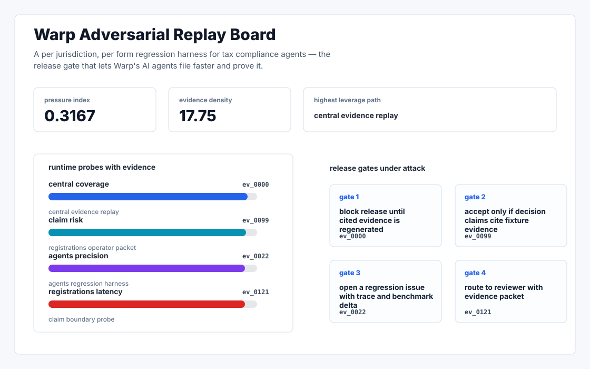
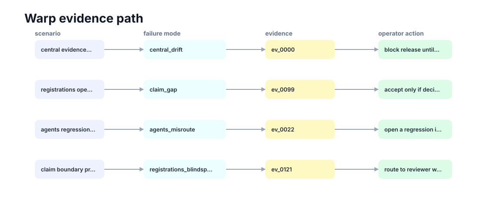

# Notice Fixture

A per jurisdiction, per form regression harness for tax compliance agents — the release gate that lets Warp's AI agents file faster and prove it.



## Why it exists

Warp's central claim is that AI agents file tax registrations, set up UI/SUTA, resolve tax notices, and handle quarterly filings across 10,000+ jurisdictions — at a 5 minute median filing time and <2% error rate (warp.co/a). The thing the public surface does not publish — and that any operator with a multi state payroll book will privately tell you is.

The project is intentionally built as a local replay harness instead of a slide. It creates fixtures, plants realistic failure modes, produces citation-locked evidence, and turns the result into a dashboard a reviewer can inspect without credentials or hosted services.

## What is inside

- Deterministic fixture generation for the company-specific risk surface.
- Strategy code in `src/notice_fixture/strategy.py` with project-specific scoring and visual evidence.
- Citation-locked reports where every decision claim points to a generated evidence ID.
- Two regenerated visual artifacts: `outputs/project_working.svg` and `outputs/evidence_map.svg`.
- A portable demo pack with JSON, CSV, Markdown, HTML, SVG, benchmark, and test artifacts.



## Signals it measures

- `central coverage`
- `claim risk`
- `agents precision`
- `registrations latency`

## Failure modes it plants

- central drift
- claim gap
- agents misroute
- registrations blindspot

## Run it locally

```bash
uv sync
uv run notice-fixture all
uv run pytest -q
uv run ruff check .
```

## Outputs worth opening

- `outputs/dashboard.html`
- `outputs/project_working.svg`
- `outputs/evidence_map.svg`
- `outputs/operator_brief.md`
- `outputs/decision_report.md`
- `outputs/strategy_model.json`
- `outputs/demo_pack.zip`

## Sources

- https://www.warp.co/a
- https://www.ycombinator.com/companies/warp
- https://www.joinwarp.com/blog/warp-yc
- https://www.warp.co/careers
- https://www.builtinnyc.com/company/warp-joinwarpcom/jobs
- https://www.checkhq.com/partners/warp
- https://www.dhrmap.com/news/new-york-based-warp-raises-18m-series-a-to-build-ai-driven-payroll-and-compliance-platform-for-startups
- https://www.linkedin.com/in/ayushsharma01/
- https://www.crunchbase.com/person/ayush-sharma-8e1a

## Boundary

Everything runs locally against synthetic fixtures. There are no credentials, no customer records, no outreach files, and no hosted API dependency.
